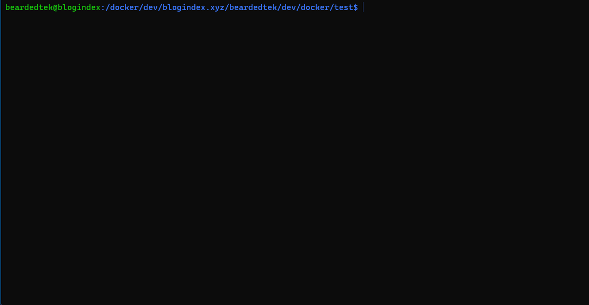

# Blogindex CI Tools

This repo is broken down into directories for different purposes:

## [docker](docker)

### Automated Testing with pytest in docker

Please see [docker](docker) for a [docker-compose.yml](docker/docker-compose.yml) to run an automated test using postgresql and python 3.11 on your local code

#### Usage:
Copy `sample.env` to `.env` and edit its contents.
```
cp sample.env .env
nano .env
```

Please note that not all information is provided and must be obtained by an admin in order to test.

This will become an automated process in the future, but for now is the only way.

```
docker compose build
docker compose up
```
##### *Note:*
If running an older version of docker, you may need to issue the commands as follows:
```
docker-compose build
docker-compose up
```

#### How does it work?
- Starts postgresql database is apidb container
- Runs a modified python-3.11 container:
    - Executes the bash script [dev/docker/test/test](dev/docker/test/test) which takes the following actions:
    - deletes any existing .test virtual environment
    - stands up a .test virtual environment
    - runs pytest


Upon Completion it will tell you the results.  From here hit `ctrl-C` and type `docker compose down`

#### Demonstration:
##### *NOTE: This GIF is sped up for clarity*


## [drone](drone)
### Tooling to run testing on an instance of [Drone CI](https://drone.io)
Currently we're running an instance of drone specifically to do CI for pushes to the blogindex/blogindex.xyz
The tooling in this directory is specifically for that and not intended for use outside drone.  While it will work, it's not recommended.

The results of CI are available publicly at https://results.blogindex.dev